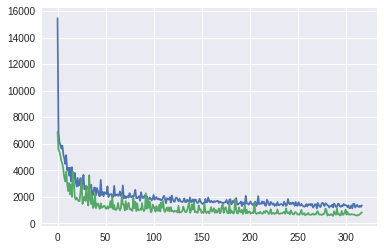
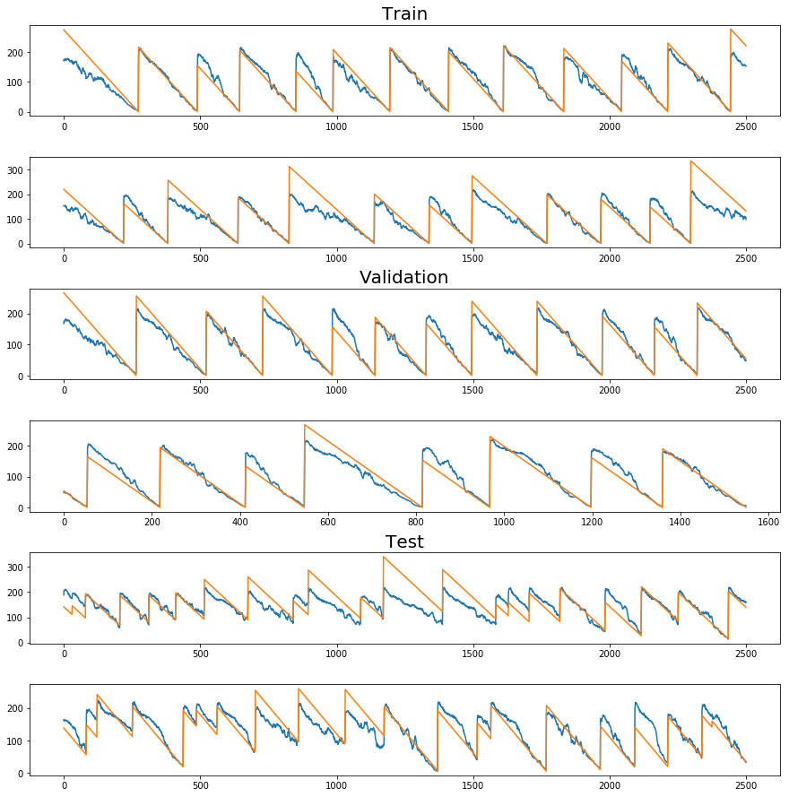
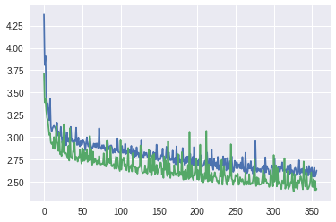
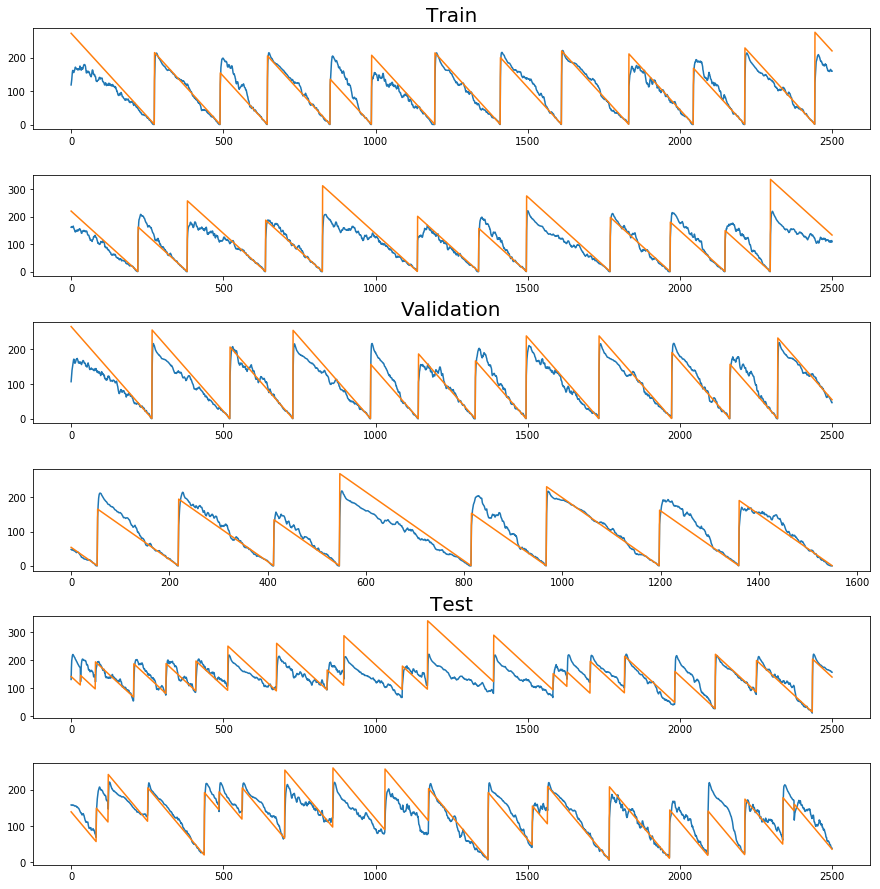
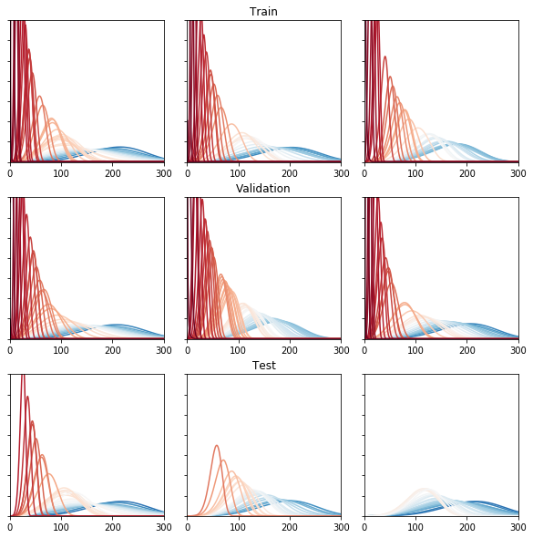

# rnn-time-to-event
An approximation of Recurrent Neural Networks to predict the Time to an Event


# Notebook

Predictive Maintenance for the Turbofan Engine Dataset

[View in Colaboratory](https://colab.research.google.com/github/Manelmc/rnn-time-to-event/blob/master/predictive-maintenance-turbofan-engine.ipynb)

## Data Preparation


```python
import keras
import keras.backend as K

print "Keras version", keras.__version__

import pandas as pd
import numpy as np
import matplotlib.pyplot as plt


# Setting seed for reproducibility
SEED = 42
np.random.seed(SEED)  
```

    Using TensorFlow backend.


    Keras version 2.1.6


```python
!mkdir Dataset
!mkdir Models

!wget -q https://raw.githubusercontent.com/Manelmc/rnn-time-to-event/master/Dataset/PM_test.txt -O Dataset/PM_test.txt
!wget -q https://raw.githubusercontent.com/Manelmc/rnn-time-to-event/master/Dataset/PM_train.txt -O Dataset/PM_train.txt  
!wget -q https://raw.githubusercontent.com/Manelmc/rnn-time-to-event/master/Dataset/PM_truth.txt -O Dataset/PM_truth.txt

!ls Dataset
```

    PM_test.txt  PM_train.txt  PM_truth.txt


### Turbofan Train Set


```python
from sklearn import preprocessing

# read training data - It is the aircraft engine run-to-failure data.
train_df = pd.read_csv('Dataset/PM_train.txt', sep=" ", header=None)
train_df.drop(train_df.columns[[26, 27]], axis=1, inplace=True)
train_df.columns = ['id', 'cycle', 'setting1', 'setting2', 'setting3', 's1', 's2', 's3',
                     's4', 's5', 's6', 's7', 's8', 's9', 's10', 's11', 's12', 's13', 's14',
                     's15', 's16', 's17', 's18', 's19', 's20', 's21']

train_df = train_df.sort_values(['id','cycle'])

# Data Labeling - generate column RUL (Remaining Useful Life or Time to Failure)
rul = pd.DataFrame(train_df.groupby('id')['cycle'].max()).reset_index()
rul.columns = ['id', 'max']
train_df = train_df.merge(rul, on=['id'], how='left')
train_df['RUL'] = train_df['max'] - train_df['cycle']
train_df.drop('max', axis=1, inplace=True)

# MinMax normalization (from 0 to 1)
train_df['cycle_norm'] = train_df['cycle']
cols_normalize = train_df.columns.difference(['id','cycle','RUL','label1','label2'])
min_max_scaler = preprocessing.MinMaxScaler()
norm_train_df = pd.DataFrame(min_max_scaler.fit_transform(train_df[cols_normalize]),
                             columns=cols_normalize,
                             index=train_df.index)
join_df = train_df[train_df.columns.difference(cols_normalize)].join(norm_train_df)
train_df = join_df.reindex(columns = train_df.columns)

train_df[train_df["id"] == 1].tail()
```


<div>
<style scoped>
    .dataframe tbody tr th:only-of-type {
        vertical-align: middle;
    }

    .dataframe tbody tr th {
        vertical-align: top;
    }

    .dataframe thead th {
        text-align: right;
    }
</style>
<table border="1" class="dataframe">
  <thead>
    <tr style="text-align: right;">
      <th></th>
      <th>id</th>
      <th>cycle</th>
      <th>setting1</th>
      <th>setting2</th>
      <th>setting3</th>
      <th>s1</th>
      <th>s2</th>
      <th>s3</th>
      <th>s4</th>
      <th>s5</th>
      <th>...</th>
      <th>s14</th>
      <th>s15</th>
      <th>s16</th>
      <th>s17</th>
      <th>s18</th>
      <th>s19</th>
      <th>s20</th>
      <th>s21</th>
      <th>RUL</th>
      <th>cycle_norm</th>
    </tr>
  </thead>
  <tbody>
    <tr>
      <th>187</th>
      <td>1</td>
      <td>188</td>
      <td>0.114943</td>
      <td>0.750000</td>
      <td>0.0</td>
      <td>0.0</td>
      <td>0.765060</td>
      <td>0.683235</td>
      <td>0.684166</td>
      <td>0.0</td>
      <td>...</td>
      <td>0.091599</td>
      <td>0.753367</td>
      <td>0.0</td>
      <td>0.666667</td>
      <td>0.0</td>
      <td>0.0</td>
      <td>0.286822</td>
      <td>0.089202</td>
      <td>4</td>
      <td>0.518006</td>
    </tr>
    <tr>
      <th>188</th>
      <td>1</td>
      <td>189</td>
      <td>0.465517</td>
      <td>0.666667</td>
      <td>0.0</td>
      <td>0.0</td>
      <td>0.894578</td>
      <td>0.547853</td>
      <td>0.772451</td>
      <td>0.0</td>
      <td>...</td>
      <td>0.090670</td>
      <td>0.744132</td>
      <td>0.0</td>
      <td>0.583333</td>
      <td>0.0</td>
      <td>0.0</td>
      <td>0.263566</td>
      <td>0.301712</td>
      <td>3</td>
      <td>0.520776</td>
    </tr>
    <tr>
      <th>189</th>
      <td>1</td>
      <td>190</td>
      <td>0.344828</td>
      <td>0.583333</td>
      <td>0.0</td>
      <td>0.0</td>
      <td>0.731928</td>
      <td>0.614345</td>
      <td>0.737677</td>
      <td>0.0</td>
      <td>...</td>
      <td>0.065229</td>
      <td>0.759523</td>
      <td>0.0</td>
      <td>0.833333</td>
      <td>0.0</td>
      <td>0.0</td>
      <td>0.271318</td>
      <td>0.239299</td>
      <td>2</td>
      <td>0.523546</td>
    </tr>
    <tr>
      <th>190</th>
      <td>1</td>
      <td>191</td>
      <td>0.500000</td>
      <td>0.166667</td>
      <td>0.0</td>
      <td>0.0</td>
      <td>0.641566</td>
      <td>0.682799</td>
      <td>0.734639</td>
      <td>0.0</td>
      <td>...</td>
      <td>0.075704</td>
      <td>0.740669</td>
      <td>0.0</td>
      <td>0.500000</td>
      <td>0.0</td>
      <td>0.0</td>
      <td>0.240310</td>
      <td>0.324910</td>
      <td>1</td>
      <td>0.526316</td>
    </tr>
    <tr>
      <th>191</th>
      <td>1</td>
      <td>192</td>
      <td>0.551724</td>
      <td>0.500000</td>
      <td>0.0</td>
      <td>0.0</td>
      <td>0.701807</td>
      <td>0.662089</td>
      <td>0.758778</td>
      <td>0.0</td>
      <td>...</td>
      <td>0.056714</td>
      <td>0.717199</td>
      <td>0.0</td>
      <td>0.666667</td>
      <td>0.0</td>
      <td>0.0</td>
      <td>0.263566</td>
      <td>0.097625</td>
      <td>0</td>
      <td>0.529086</td>
    </tr>
  </tbody>
</table>
<p>5 rows × 28 columns</p>
</div>


### Turbofan Test Set


```python
from sklearn import preprocessing

# read test data - It is the aircraft engine operating data without failure events recorded.
test_df = pd.read_csv('Dataset/PM_test.txt', sep=" ", header=None)
test_df.drop(test_df.columns[[26, 27]], axis=1, inplace=True)
test_df.columns = ['id', 'cycle', 'setting1', 'setting2', 'setting3', 's1', 's2', 's3',
                     's4', 's5', 's6', 's7', 's8', 's9', 's10', 's11', 's12', 's13', 's14',
                     's15', 's16', 's17', 's18', 's19', 's20', 's21']

# MinMax normalization (from 0 to 1)
test_df['cycle_norm'] = test_df['cycle']
norm_test_df = pd.DataFrame(min_max_scaler.transform(test_df[cols_normalize]),
                            columns=cols_normalize,
                            index=test_df.index)
test_join_df = test_df[test_df.columns.difference(cols_normalize)].join(norm_test_df)
test_df = test_join_df.reindex(columns = test_df.columns)
test_df = test_df.reset_index(drop=True)

# read ground truth data - It contains the information of true remaining cycles for each engine in the testing data.
truth_df = pd.read_csv('Dataset/PM_truth.txt', sep=" ", header=None)
truth_df.drop(truth_df.columns[[1]], axis=1, inplace=True)

# generate column max for test data
rul = pd.DataFrame(test_df.groupby('id')['cycle'].max()).reset_index()
rul.columns = ['id', 'max']
truth_df.columns = ['more']
truth_df['id'] = truth_df.index + 1
truth_df['max'] = rul['max'] + truth_df['more']
truth_df.drop('more', axis=1, inplace=True)

# generate RUL for test data
test_df = test_df.merge(truth_df, on=['id'], how='left')
test_df['RUL'] = test_df['max'] - test_df['cycle']
test_df.drop('max', axis=1, inplace=True)

test_df[test_df["id"] == 1].tail()
```


<div>
<style scoped>
    .dataframe tbody tr th:only-of-type {
        vertical-align: middle;
    }

    .dataframe tbody tr th {
        vertical-align: top;
    }

    .dataframe thead th {
        text-align: right;
    }
</style>
<table border="1" class="dataframe">
  <thead>
    <tr style="text-align: right;">
      <th></th>
      <th>id</th>
      <th>cycle</th>
      <th>setting1</th>
      <th>setting2</th>
      <th>setting3</th>
      <th>s1</th>
      <th>s2</th>
      <th>s3</th>
      <th>s4</th>
      <th>s5</th>
      <th>...</th>
      <th>s14</th>
      <th>s15</th>
      <th>s16</th>
      <th>s17</th>
      <th>s18</th>
      <th>s19</th>
      <th>s20</th>
      <th>s21</th>
      <th>cycle_norm</th>
      <th>RUL</th>
    </tr>
  </thead>
  <tbody>
    <tr>
      <th>26</th>
      <td>1</td>
      <td>27</td>
      <td>0.459770</td>
      <td>0.583333</td>
      <td>0.0</td>
      <td>0.0</td>
      <td>0.262048</td>
      <td>0.340310</td>
      <td>0.304862</td>
      <td>0.0</td>
      <td>...</td>
      <td>0.140881</td>
      <td>0.479030</td>
      <td>0.0</td>
      <td>0.333333</td>
      <td>0.0</td>
      <td>0.0</td>
      <td>0.565891</td>
      <td>0.688898</td>
      <td>0.072022</td>
      <td>116</td>
    </tr>
    <tr>
      <th>27</th>
      <td>1</td>
      <td>28</td>
      <td>0.626437</td>
      <td>0.916667</td>
      <td>0.0</td>
      <td>0.0</td>
      <td>0.216867</td>
      <td>0.505995</td>
      <td>0.321404</td>
      <td>0.0</td>
      <td>...</td>
      <td>0.180359</td>
      <td>0.469796</td>
      <td>0.0</td>
      <td>0.333333</td>
      <td>0.0</td>
      <td>0.0</td>
      <td>0.534884</td>
      <td>0.629660</td>
      <td>0.074792</td>
      <td>115</td>
    </tr>
    <tr>
      <th>28</th>
      <td>1</td>
      <td>29</td>
      <td>0.580460</td>
      <td>0.583333</td>
      <td>0.0</td>
      <td>0.0</td>
      <td>0.222892</td>
      <td>0.351210</td>
      <td>0.267725</td>
      <td>0.0</td>
      <td>...</td>
      <td>0.171277</td>
      <td>0.370527</td>
      <td>0.0</td>
      <td>0.333333</td>
      <td>0.0</td>
      <td>0.0</td>
      <td>0.682171</td>
      <td>0.646092</td>
      <td>0.077562</td>
      <td>114</td>
    </tr>
    <tr>
      <th>29</th>
      <td>1</td>
      <td>30</td>
      <td>0.356322</td>
      <td>0.833333</td>
      <td>0.0</td>
      <td>0.0</td>
      <td>0.475904</td>
      <td>0.320035</td>
      <td>0.316003</td>
      <td>0.0</td>
      <td>...</td>
      <td>0.179843</td>
      <td>0.331281</td>
      <td>0.0</td>
      <td>0.250000</td>
      <td>0.0</td>
      <td>0.0</td>
      <td>0.736434</td>
      <td>0.707954</td>
      <td>0.080332</td>
      <td>113</td>
    </tr>
    <tr>
      <th>30</th>
      <td>1</td>
      <td>31</td>
      <td>0.465517</td>
      <td>0.833333</td>
      <td>0.0</td>
      <td>0.0</td>
      <td>0.412651</td>
      <td>0.221932</td>
      <td>0.281229</td>
      <td>0.0</td>
      <td>...</td>
      <td>0.155692</td>
      <td>0.298192</td>
      <td>0.0</td>
      <td>0.416667</td>
      <td>0.0</td>
      <td>0.0</td>
      <td>0.519380</td>
      <td>0.636564</td>
      <td>0.083102</td>
      <td>112</td>
    </tr>
  </tbody>
</table>
<p>5 rows × 28 columns</p>
</div>


### Apply right padding to all the sequences


```python
def pad_sequence(df, max_seq_length, mask=0):
    """
    Applies right padding to a sequences until max_seq_length with mask
    """
    return np.pad(df.values, ((0, max_seq_length - df.values.shape[0]), (0,0)),
                  "constant", constant_values=mask)

def pad_engines(df, cols, max_batch_len, mask=0):
    """
    Applies right padding to the columns "cols" of all the engines
    """
    return np.array([pad_sequence(df[df['id'] == batch_id][cols], max_batch_len, mask=mask)
                     for batch_id in df['id'].unique()])

max_batch_len = train_df['id'].value_counts().max()
train_cols = ['s' + str(i) for i in range(1,22)] + ['setting1', 'setting2', 'setting3', 'cycle_norm']
test_cols = ["RUL"]

X = pad_engines(train_df, train_cols, max_batch_len)
Y = pad_engines(train_df, test_cols, max_batch_len)
```

### Split into train, validation and test


```python
from sklearn.model_selection import train_test_split

# Split into train and validation
train_X, val_X, train_Y, val_Y = train_test_split(X, Y, test_size=0.20, random_state=SEED)

# Test set from CMAPSS
test_X = pad_engines(test_df, train_cols, max_batch_len)
test_Y = pad_engines(test_df, test_cols, max_batch_len)

# In the WTTE-RNN architecture we will predict 2 parameters (alpha and beta)
# alpha is initialised to 1
train_Y_wtte = np.concatenate((train_Y, np.ones(train_Y.shape)), axis=2)
val_Y_wtte = np.concatenate((val_Y, np.ones(val_Y.shape)), axis=2)
test_Y_wtte = np.concatenate((test_Y, np.ones(test_Y.shape)), axis=2)

print "Train:\n", "  X:", train_X.shape, "\n  Y:", train_Y.shape, "\n  Y_wtte:", train_Y_wtte.shape
print "\nValidation:\n", "  X:", val_X.shape, "\n  Y:", val_Y.shape, "\n  Y_wtte:", val_Y_wtte.shape
print "\nTest:\n", "  X:", test_X.shape, "\n  Y:", test_Y.shape, "\n  Y_wtte:", test_Y_wtte.shape
```

    Train:
      X: (80, 362, 25)
      Y: (80, 362, 1)
      Y_wtte: (80, 362, 2)

    Validation:
      X: (20, 362, 25)
      Y: (20, 362, 1)
      Y_wtte: (20, 362, 2)

    Test:
      X: (100, 362, 25)
      Y: (100, 362, 1)
      Y_wtte: (100, 362, 2)


## Baseline


```python
from keras.layers import Masking
from keras.layers.core import Activation
from keras.models import Sequential
from keras.layers import Dense, LSTM, TimeDistributed
from keras.callbacks import EarlyStopping, ModelCheckpoint

# Model path
baseline_path = "baseline_model"

# Callbacks
early_stopping = EarlyStopping(monitor='val_loss',
                               min_delta=0,
                               patience=30,
                               verbose=0,
                               mode='min')
checkpoint = ModelCheckpoint(baseline_path,
                             monitor='val_loss',
                             save_best_only=True,
                             mode='min',
                             verbose=0)
# dimensions of the model
nb_features = train_X.shape[2]
nb_out = train_Y.shape[2]

model = Sequential()
# Masking layer so the right padding is ignored
# at each layer of the network
model.add(Masking(mask_value=0.,
                  input_shape=(max_batch_len, nb_features)))
# Then there s an LSTM layer with 100 units
# Recurrent Dropout is also applied after each
# LSTM layer to control overfitting.
model.add(LSTM(
         units=100,
         recurrent_dropout=0.2,
         return_sequences=True))
# followed by another LSTM layer with 50 units
model.add(LSTM(
         units=50,
         recurrent_dropout=0.2,
         return_sequences=True))
# Final layer is a Time-Distributed Dense layer
# with a single unit with an Exponential activation
model.add(TimeDistributed(Dense(nb_out, activation=K.exp)))
model.compile(loss="mse", optimizer=keras.optimizers.RMSprop())

print(model.summary())

# fit the network
history = model.fit(train_X, train_Y, epochs=500, batch_size=16,
                    validation_data=(val_X, val_Y), shuffle=True,
                    verbose=2, callbacks = [early_stopping, checkpoint])

# list all data in history
print(history.history.keys())
```

    _________________________________________________________________
    Layer (type)                 Output Shape              Param #   
    =================================================================
    masking_1 (Masking)          (None, 362, 25)           0         
    _________________________________________________________________
    lstm_1 (LSTM)                (None, 362, 100)          50400     
    _________________________________________________________________
    lstm_2 (LSTM)                (None, 362, 50)           30200     
    _________________________________________________________________
    time_distributed_1 (TimeDist (None, 362, 1)            51        
    =================================================================
    Total params: 80,651
    Trainable params: 80,651
    Non-trainable params: 0
    _________________________________________________________________
    None
    Train on 80 samples, validate on 20 samples
    ...
     - 15s - loss: 1204.1237 - val_loss: 621.4485
    Epoch 312/500
     - 15s - loss: 1293.4628 - val_loss: 611.2367
    Epoch 313/500
     - 15s - loss: 1410.6540 - val_loss: 599.2881
    Epoch 314/500
     - 15s - loss: 1280.4136 - val_loss: 651.2672
    Epoch 315/500
     - 15s - loss: 1233.0307 - val_loss: 634.8255
    Epoch 316/500
     - 15s - loss: 1339.8630 - val_loss: 702.0963
    Epoch 317/500
     - 14s - loss: 1249.2757 - val_loss: 789.5427
    Epoch 318/500
     - 15s - loss: 1364.1424 - val_loss: 834.3046
    ['loss', 'val_loss']


```python
# Execute if training in Colaboratory (preferably from Chrome)
# Downloads the model after the training finishes

from google.colab import files
files.download(baseline_path)

# Move the model to the expected folder
!mv baseline_path Models/
```


```python
# Validation loss vs the Training loss

%matplotlib inline

plt.plot(history.history["loss"])
plt.plot(history.history["val_loss"])
```


    [<matplotlib.lines.Line2D at 0x7f6039681c50>]





```python
# Execute if you want to upload a model to Collaboratory

from google.colab import files
uploaded = files.upload()

for fn in uploaded.keys():
    print('User uploaded file "{name}" with length {length} bytes'.format(
      name=fn, length=len(uploaded[fn])))
```


     <input type="file" id="files-f6e556f7-746f-4e94-b68a-9859a114544e" name="files[]" multiple disabled />
     <output id="result-f6e556f7-746f-4e94-b68a-9859a114544e">
      Upload widget is only available when the cell has been executed in the
      current browser session. Please rerun this cell to enable.
      </output>
      <script src="/nbextensions/google.colab/files.js"></script>


```python
from keras.models import load_model

# It's important to load the model after the training
# The keras Checkpoint will save the best model in terms
# of the validation loss in the specified path
model = load_model("Models/" + baseline_path, custom_objects={"exp": K.exp})
```


```python
%matplotlib inline
from math import sqrt

from sklearn.metrics import mean_squared_error, mean_absolute_error, r2_score

# We save the validation errors to later compare the models
validation_baseline = model.predict(val_X).flatten()

def evaluate_and_plot(model, evaluation_data, weibull_function=None):
    """
    Generate scores dataframe and plot the RUL
    """
    fig = plt.figure()
    i = 1
    score_df = pd.DataFrame({"Method": ["MAE", "RMSE", "R2"]})
    for name_set, train_set, test_set in evaluation_data:
        if weibull_function is None:
            y_pred = model.predict(train_set).flatten()
        else:
            y_pred = [weibull_function(alpha, beta)
                      for batch in model.predict(train_set)
                      for beta, alpha in batch]
        l = test_set[:,:,0].flatten()
        # To validate we remove the right padding
        y_true = np.ma.compressed(np.ma.masked_where(l==0, l))
        y_pred = np.ma.compressed(np.ma.masked_where(l==0, y_pred))
        score_mae = "{0:.2f}".format(mean_absolute_error(y_true, y_pred))
        score_rmse = "{0:.2f}".format(sqrt(mean_squared_error(y_true, y_pred)))
        score_r2 = "{0:.3f}".format(r2_score(y_true, y_pred))
        score_df[name_set] = [score_mae, score_rmse, score_r2]
        ax = fig.add_subplot(6, 1, i)
        ax.title.set_text(name_set)
        ax.title.set_fontsize(20)
        i += 1
        plt.plot(y_pred[0:2500])
        plt.plot(y_true[0:2500])
        ax = fig.add_subplot(6, 1, i)
        i += 1
        plt.plot(y_pred[2500:5000])
        plt.plot(y_true[2500:5000])
    plt.subplots_adjust(hspace=0.45)
    fig.set_size_inches(15, i*2.2)
    return score_df.T

evaluate_and_plot(model,
                  [("Train", train_X, train_Y),
                   ("Validation", val_X, val_Y),
                   ("Test", test_X, test_Y)])
```


<div>
<style scoped>
    .dataframe tbody tr th:only-of-type {
        vertical-align: middle;
    }

    .dataframe tbody tr th {
        vertical-align: top;
    }

    .dataframe thead th {
        text-align: right;
    }
</style>
<table border="1" class="dataframe">
  <thead>
    <tr style="text-align: right;">
      <th></th>
      <th>0</th>
      <th>1</th>
      <th>2</th>
    </tr>
  </thead>
  <tbody>
    <tr>
      <th>Method</th>
      <td>MAE</td>
      <td>RMSE</td>
      <td>R2</td>
    </tr>
    <tr>
      <th>Train</th>
      <td>21.19</td>
      <td>33.57</td>
      <td>0.766</td>
    </tr>
    <tr>
      <th>Validation</th>
      <td>17.36</td>
      <td>23.98</td>
      <td>0.866</td>
    </tr>
    <tr>
      <th>Test</th>
      <td>27.03</td>
      <td>37.41</td>
      <td>0.598</td>
    </tr>
  </tbody>
</table>
</div>





## Adapting to WTTE-RNN


```python
# Install wtte package from Martinsson

!pip install wtte
```

    Collecting wtte
      Downloading https://files.pythonhosted.org/packages/95/0e/8affc53f47d4ceb69fc80484fd87ad886c6cab7f4ce0add38076b6092d76/wtte-1.1.1-py2.py3-none-any.whl
    Requirement already satisfied: scipy in /usr/local/lib/python2.7/dist-packages (from wtte) (0.19.1)
    Requirement already satisfied: numpy in /usr/local/lib/python2.7/dist-packages (from wtte) (1.14.5)
    Requirement already satisfied: keras>=2.0 in /usr/local/lib/python2.7/dist-packages (from wtte) (2.1.6)
    Requirement already satisfied: pandas in /usr/local/lib/python2.7/dist-packages (from wtte) (0.22.0)
    Collecting six==1.10.0 (from wtte)
      Downloading https://files.pythonhosted.org/packages/c8/0a/b6723e1bc4c516cb687841499455a8505b44607ab535be01091c0f24f079/six-1.10.0-py2.py3-none-any.whl
    Requirement already satisfied: pyyaml in /usr/local/lib/python2.7/dist-packages (from keras>=2.0->wtte) (3.13)
    Requirement already satisfied: h5py in /usr/local/lib/python2.7/dist-packages (from keras>=2.0->wtte) (2.8.0)
    Requirement already satisfied: pytz>=2011k in /usr/local/lib/python2.7/dist-packages (from pandas->wtte) (2018.5)
    Requirement already satisfied: python-dateutil in /usr/local/lib/python2.7/dist-packages (from pandas->wtte) (2.5.3)
    Installing collected packages: six, wtte
      Found existing installation: six 1.11.0
        Uninstalling six-1.11.0:
          Successfully uninstalled six-1.11.0
    Successfully installed six-1.10.0 wtte-1.1.1


```python
# Loss and activation functions from Martinsson
# These are not used in the final version because
# the wtte package has useful regularization tools

def weibull_loglik_discrete(y_true, y_pred, epsilon=K.epsilon()):
    y = y_true[..., 0]
    u = y_true[..., 1]
    a = y_pred[..., 0]
    b = y_pred[..., 1]

    hazard0 = K.pow((y + epsilon) / a, b)
    hazard1 = K.pow((y + 1.0) / a, b)

    loss = u * K.log(K.exp(hazard1 - hazard0) - (1.0 - epsilon)) - hazard1
    return -loss

def activation_weibull(y_true):
    a = y_true[..., 0]
    b = y_true[..., 1]

    a = K.exp(a)
    b = K.sigmoid(b)
    return K.stack([a, b], axis=-1)
```


```python
from keras.layers import Masking
from keras.layers.core import Activation
from keras.models import Sequential
from keras.layers import Dense, LSTM, TimeDistributed, Lambda
from keras.callbacks import EarlyStopping, TerminateOnNaN, ModelCheckpoint
import wtte.weibull as weibull
import wtte.wtte as wtte

# Since we use a lambda in the last layer the model
# is not saved well in keras, instead we save the weights.
# This requires compiling the model to load the weights
baseline_wtte_path = "baseline_wtte_model_weights"
# Callbacks
early_stopping = EarlyStopping(monitor='val_loss',
                               min_delta=0,
                               patience=30,
                               verbose=0,
                               mode='min')
checkpoint = ModelCheckpoint(baseline_wtte_path,
                             monitor='val_loss',
                             save_best_only=True,
                             save_weights_only=True,
                             mode='min',
                             verbose=0)

nb_features = train_X.shape[2]
nb_out = train_Y.shape[1]

model = Sequential()

model.add(Masking(mask_value=0.,
                  input_shape=(max_batch_len, nb_features)))
model.add(LSTM(
         input_shape=(None, nb_features),
         units=100,
         recurrent_dropout=0.2,
         return_sequences=True))
model.add(LSTM(
          units=50,
          recurrent_dropout=0.2,
          return_sequences=True))
model.add(TimeDistributed(Dense(2)))
# uncomment this line and comment the next to use
# activation_weibull function:
# model.add(Activation(activation_weibull))
model.add(Lambda(wtte.output_lambda,
                 arguments={# Initialization value around it's scale
                            "init_alpha": np.nanmean(train_Y_wtte[:,0]),
                            # Set a maximum
                            "max_beta_value": 10.0
                           },
                ))
# Same for the loss "weibull_loglik_discrete"
# model.compile(loss=weibull_loglik_discrete, optimizer='rmsprop')
# We use clipping on the loss
loss = wtte.Loss(kind='discrete', clip_prob=1e-5).loss_function

model.compile(loss=loss, optimizer='rmsprop')
```


```python
print(model.summary())

# fit the network
history = model.fit(train_X, train_Y_wtte, epochs=500, batch_size=16,
                    validation_data=(val_X, val_Y_wtte), shuffle=True, verbose=2,
                    callbacks = [early_stopping, checkpoint, TerminateOnNaN()])

# list all data in history
print(history.history.keys())
```

    _________________________________________________________________
    Layer (type)                 Output Shape              Param #   
    =================================================================
    masking_4 (Masking)          (None, None, 25)          0         
    _________________________________________________________________
    lstm_7 (LSTM)                (None, None, 100)         50400     
    _________________________________________________________________
    lstm_8 (LSTM)                (None, None, 50)          30200     
    _________________________________________________________________
    time_distributed_4 (TimeDist (None, None, 2)           102       
    _________________________________________________________________
    lambda_2 (Lambda)            (None, None, 2)           0         
    =================================================================
    Total params: 80,702
    Trainable params: 80,702
    Non-trainable params: 0
    _________________________________________________________________
    None
    Train on 80 samples, validate on 20 samples
    ...
    Epoch 352/500
     - 12s - loss: 2.5586 - val_loss: 2.4429
    Epoch 353/500
     - 13s - loss: 2.5923 - val_loss: 2.5299
    Epoch 354/500
     - 12s - loss: 2.6591 - val_loss: 2.4070
    Epoch 355/500
     - 12s - loss: 2.5594 - val_loss: 2.5139
    Epoch 356/500
     - 13s - loss: 2.5870 - val_loss: 2.4082
    Epoch 357/500
     - 12s - loss: 2.6275 - val_loss: 2.4218
    ['loss', 'val_loss']


```python
# Execute if training in Colaboratory (preferably from Chrome)
# Downloads the model after the training finishes

from google.colab import files
files.download(baseline_wtte_path)

# Move the model to the expected folder
!mv baseline_wtte_path Models/
```


```python
%matplotlib inline


plt.plot(history.history["loss"])
plt.plot(history.history["val_loss"])
```


    [<matplotlib.lines.Line2D at 0x7f351865d990>]





```python
# Execute if you want to upload a model to Collaboratory

from google.colab import files
uploaded = files.upload()

for fn in uploaded.keys():
    print('User uploaded file "{name}" with length {length} bytes'.format(
      name=fn, length=len(uploaded[fn])))
```


     <input type="file" id="files-8f58d2a2-d3f6-43fa-93dc-a6fbf59eed70" name="files[]" multiple disabled />
     <output id="result-8f58d2a2-d3f6-43fa-93dc-a6fbf59eed70">
      Upload widget is only available when the cell has been executed in the
      current browser session. Please rerun this cell to enable.
      </output>
      <script src="/nbextensions/google.colab/files.js"></script>


    Saving baseline_wtte_model_weights (1) to baseline_wtte_model_weights (1)
    User uploaded file "baseline_wtte_model_weights (1)" with length 340528 bytes


```python
# Compile model first to load weights

model.load_weights("Models/" + baseline_wtte_path)
```

### Weibull Methods

$\mu = \beta\Gamma(1 + \alpha^{-1})$

$\sigma^2 = \beta^2[\Gamma(1 + 2\alpha^{-1}) - \Gamma^2(1 + \alpha^{-1})]$

$mode = \beta\frac{\alpha-1}{\alpha}^{1/\alpha}$

Inverse CDF $ = \beta (-\log(1 - x))^\frac{1}{\alpha} $ when $ 0<x<1 $


```python
from math import gamma, log, sqrt

def mean_weibull(alpha, beta):
    return beta*gamma(1 + 1./alpha)

def mode_weibull(alpha, beta):
    return beta*((alpha-1)/alpha)**(1./alpha) if alpha > 1 else 0

def median_weibull(alpha, beta):
    return beta*(log(2)**(1./alpha))

def var_weibull(alpha, beta):
    return beta**2*(gamma(1 + 2./alpha) - gamma(1 + 1./alpha)**2)

def pdf_weibull(x, alpha, beta):
    return (alpha/beta)*(x/beta)**(alpha - 1)*np.exp(-(x/beta)**alpha)

def inverse_cdf_weibull(x, alpha, beta):
    return beta*np.power((-np.log(1.-x)), 1./alpha)

def survival_weibull(x, alpha, beta):
    return np.e**-((x/beta)**alpha)
```

### Mean, Mode and Median


```python
%matplotlib inline

print "Mode"
print evaluate_and_plot(model,
                        [("Train", train_X, train_Y_wtte),
                         ("Validation", val_X, val_Y_wtte),
                         ("Test", test_X, test_Y_wtte)],
                        weibull_function = mode_weibull)

# comment the next line to visualise the plot for the mode
plt.close()

print "\nMedian"
print evaluate_and_plot(model,
                        [("Train", train_X, train_Y_wtte),
                         ("Validation", val_X, val_Y_wtte),
                         ("Test", test_X, test_Y_wtte)],
                        weibull_function = median_weibull)

# comment the next line to visualise the plot for the median
plt.close()

# We save the validation errors to later compare the models
validation_wtte = [mean_weibull(alpha, beta)
                   for batch in model.predict(val_X)
                   for beta, alpha in batch]

print "\nMean"
print evaluate_and_plot(model,
                        [("Train", train_X, train_Y_wtte),
                         ("Validation", val_X, val_Y_wtte),
                         ("Test", test_X, test_Y_wtte)],
                        weibull_function = mean_weibull)
```

    Mode
                    0      1      2
    Method        MAE   RMSE     R2
    Train       21.53  34.69  0.750
    Validation  17.94  26.48  0.836
    Test        27.46  38.59  0.572

    Median
                    0      1      2
    Method        MAE   RMSE     R2
    Train       21.05  33.51  0.767
    Validation  17.79  25.48  0.848
    Test        26.72  37.49  0.596

    Mean
                    0      1      2
    Method        MAE   RMSE     R2
    Train       20.94  33.14  0.772
    Validation  17.79  25.26  0.851
    Test        26.51  37.22  0.602





### Evolution of the pdf through the cycles of an engine (PLOT)


```python
import random

import seaborn as sns


random.seed(SEED)
lot = random.sample(train_X, 3)
random.seed(SEED)
lot += random.sample(val_X, 3)
random.seed(SEED)
lot += random.sample(test_X, 3)

palette = list(reversed(sns.color_palette("RdBu_r", 250)))

fig = plt.figure()
j = 1
for batch in lot:
    size = batch[~np.all(batch == 0, axis=1)].shape[0]
    y_pred_wtte = model.predict(batch.reshape(1, max_batch_len, nb_features))[0]
    y_pred_wtte = y_pred_wtte[:size]
    x = np.arange(1, 400.)

    freq = 5
    ax = fig.add_subplot(3, 3, j)

    i=0
    for beta, alpha in y_pred_wtte[0::freq][2:]:
        mean = mode_weibull(alpha, beta)
        color=palette[int(mean)] if i < len(palette) else palette[-1]
        plt.plot(x, pdf_weibull(x, alpha, beta), color=color)
        i += 1
    ax.set_ylim([0, 0.07])
    ax.set_xlim([0, 300])
    ax.set_yticklabels([])
    if j == 2:
        ax.title.set_text("Train")
    elif j == 5:
        ax.title.set_text("Validation")
    elif j == 8:
        ax.title.set_text("Test")
    j += 1

plt.subplots_adjust(wspace=0.15, hspace=0.25)
fig.set_size_inches(10,10)
```





### Confidence Interval of the Weibull Distribution


```python
%matplotlib inline

from scipy.stats import dweibull

batch = lot[0]
size = batch[~np.all(batch == 0, axis=1)].shape[0]
y_pred_wtte = model.predict(batch.reshape(1, max_batch_len, nb_features))[0]
y_pred_wtte = y_pred_wtte[:size]

fig = plt.figure()
fig.add_subplot(1,1,1)
for beta, alpha in y_pred_wtte[0::20]:
    x = np.arange(1, 300.)
    mean = mean_weibull(alpha, beta)
    sigma = np.sqrt(var_weibull(alpha, beta))
    plt.plot(x, pdf_weibull(x, alpha, beta), color=palette[int(mean)])
    # alpha is the shape parameter
    conf = dweibull.interval(0.95, alpha, loc=mean, scale=sigma)
    plt.fill([conf[0]] + list(np.arange(conf[0], conf[1])) + [conf[1]],
             [0] + list(pdf_weibull(np.arange(conf[0], conf[1]), alpha, beta)) + [0],
             color=palette[int(mean)], alpha=0.5)

axes = plt.gca()
axes.set_ylim([0., 0.06])
axes.set_xlim([0., 300.])
fig.set_size_inches(10,5)
```

    /anaconda2/envs/ALL_BF/lib/python2.7/site-packages/ipykernel_launcher.py:16: RuntimeWarning: invalid value encountered in power
      app.launch_new_instance()


### Evolution of the pdf through the cycles of an engine (GIFs)


```python
import sys
import random
from math import gamma

from matplotlib.animation import FuncAnimation
from scipy.stats import dweibull


def generate_gif(y_pred, y_true, path, freq=2):
    # remove mask if exists
    y_true = y_true[y_true != 0]
    y_pred = y_pred[:y_true.shape[0]]

    frames = zip(y_true, y_pred)

    # pad, w_pad, h_pad, and rect
    fig = plt.figure()
    global ax1, ax2
    ax1 = fig.add_subplot(1,2,1)
    ax2 = fig.add_subplot(1,2,2)
    fig.set_tight_layout(True)
    x = np.arange(1, 300.)
    beta, alpha = y_pred[0]
    line1, = ax1.plot(x, pdf_weibull(x, alpha, beta))
    global i, acc_y_true, acc_y_pred
    i = 0
    predict_mean = mean_weibull(alpha, beta)
    ax2.plot(i, y_true[0], 'bo', label="True", ms=2.5)
    ax2.plot(i, predict_mean, 'o', color="orange", label="Predicted", ms=2.5)
    ax2.legend(loc="upper right")
    # limits
    ax1.set_ylim([0, 0.07])
    ax2.set_ylim([0, y_true[0] + 10])
    ax2.set_xlim([0, len(frames)/freq + 2])
    ax2.set_xticklabels([])
    # acc values
    acc_y_true = []
    acc_y_pred = []

    def update(instant):
        y_true_t, y_pred_t = instant
        beta, alpha = y_pred_t
        # print y_true
        pdf = pdf_weibull(x, alpha, beta)
        line1.set_ydata(pdf)
        global i, acc_y_true, acc_y_pred
        i += 1
        mean = mean_weibull(alpha, beta)
        sigma = np.sqrt(var_weibull(alpha, beta))
        acc_y_pred += [mean]
        acc_y_true += [y_true_t]
        ax2.plot(range(len(acc_y_true)), acc_y_true, 'b', label="True")
        ax2.plot(range(len(acc_y_pred)), acc_y_pred, color="orange", label="Predicted")
        conf = dweibull.interval(0.95, alpha, loc=mean, scale=sigma)
        ax1.set_title("PDF Weibull Distrib. (Mean: " + "{0:.1f}".format(mean)
                     + ", Std: " + "{0:.1f}".format(sigma) + ")"
                     + " CI 95%: [{0:.1f}, {1:.1f}]".format(*conf))
        ax2.set_title("Real RUL: " + str(y_true_t) + " cycles")

    fig.set_size_inches(15,4)
    anim = FuncAnimation(fig, update, frames=frames[0::freq])
    anim.save(path, writer="imagemagick")
    plt.close()

random.seed(SEED)
batch_X, batch_Y = random.choice(zip(train_X, train_Y))
y_pred_wtte = model.predict(batch_X.reshape(1, max_batch_len, nb_features))[0]
gif_path = "Images/train_engine_sample.gif"
generate_gif(y_pred_wtte, batch_Y, gif_path, freq=2)

print "Train Sample"
from IPython.display import HTML
HTML('')
```

    Train Sample


```python
random.seed(SEED)
batch_X, batch_Y = random.choice(zip(val_X, val_Y))
y_pred_wtte = model.predict(batch_X.reshape(1, max_batch_len, nb_features))[0]
gif_path = "Images/val_engine_sample.gif"
generate_gif(y_pred_wtte, batch_Y, gif_path, freq=2)

print "Validation Sample"
from IPython.display import HTML
HTML('')
```

    Validation Sample


```python
random.seed(SEED)
batch_X, batch_Y = random.choice(zip(test_X, test_Y))
y_pred_wtte = model.predict(batch_X.reshape(1, max_batch_len, nb_features))[0]
gif_path = "Images/test_engine_sample.gif"
generate_gif(y_pred_wtte, batch_Y, gif_path, freq=2)

print "Test Sample"
from IPython.display import HTML
HTML('')
```

    Test Sample


## GRU variant


```python
from keras.layers import Masking
from keras.layers.core import Activation
from keras.models import Sequential
from keras.layers import Dense, GRU, TimeDistributed, Lambda
from keras.callbacks import EarlyStopping, TerminateOnNaN, ModelCheckpoint
import wtte.weibull as weibull
import wtte.wtte as wtte

baseline_gru_path = "baseline_gru_model_weights"

# Callbacks
early_stopping = EarlyStopping(monitor='val_loss',
                               min_delta=0,
                               patience=30,
                               verbose=0,
                               mode='min')
checkpoint = ModelCheckpoint(baseline_gru_path,
                             monitor='val_loss',
                             save_best_only=True,
                             save_weights_only=True,
                             mode='min',
                             verbose=0)

nb_features = train_X.shape[2]
nb_out = train_Y.shape[1]

init_alpha = np.nanmean(train_Y_wtte[:,0])

model = Sequential()
model.add(Masking(mask_value=0.,
                  input_shape=(max_batch_len, nb_features)))
# We substitute LSTM for GRU
model.add(GRU(
         input_shape=(None, nb_features),
         units=100,
         recurrent_dropout=0.2,
         return_sequences=True))
model.add(GRU(
          units=50,
          recurrent_dropout=0.2,
          return_sequences=True))
model.add(TimeDistributed(Dense(2)))
model.add(Lambda(wtte.output_lambda,
                 arguments={# Initialization value around it's scale
                            "init_alpha": np.nanmean(train_Y_wtte[:,0]),
                            # Set a maximum
                            "max_beta_value": 10.0,
                            # We set the scalefactor to avoid exploding gradients
                            "scalefactor": 0.25
                           },
                ))
loss = wtte.Loss(kind='discrete', clip_prob=1e-5).loss_function
model.compile(loss=loss, optimizer='rmsprop')
```


```python
print(model.summary())

# fit the network
history = model.fit(train_X, train_Y_wtte, epochs=500, batch_size=16,
                    validation_data=(val_X, val_Y_wtte), shuffle=True, verbose=2,
                    callbacks = [early_stopping, checkpoint, TerminateOnNaN()])

# list all data in history
print(history.history.keys())
```

    _________________________________________________________________
    Layer (type)                 Output Shape              Param #   
    =================================================================
    masking_6 (Masking)          (None, None, 25)          0         
    _________________________________________________________________
    gru_6 (GRU)                  (None, None, 100)         37800     
    _________________________________________________________________
    gru_7 (GRU)                  (None, None, 50)          22650     
    _________________________________________________________________
    time_distributed_5 (TimeDist (None, None, 2)           102       
    _________________________________________________________________
    lambda_5 (Lambda)            (None, None, 2)           0         
    =================================================================
    Total params: 60,552
    Trainable params: 60,552
    Non-trainable params: 0
    _________________________________________________________________
    None
    Train on 80 samples, validate on 20 samples
    ...
    Epoch 379/500
     - 4s - loss: 2.5791 - val_loss: 2.4811
    Epoch 380/500
     - 4s - loss: 2.4674 - val_loss: 2.3694
    Epoch 381/500
     - 4s - loss: 2.4272 - val_loss: 2.3636
    Epoch 382/500
     - 4s - loss: 2.4483 - val_loss: 2.4244
    Epoch 383/500
     - 4s - loss: 2.4518 - val_loss: 2.4219
    Epoch 384/500
     - 4s - loss: 2.4448 - val_loss: 2.3649
    Epoch 385/500
     - 4s - loss: 2.5142 - val_loss: 2.3681
    Epoch 386/500
     - 4s - loss: 2.4157 - val_loss: 2.4423
    ['loss', 'val_loss']


```python
# Execute if training in Colaboratory (preferably from Chrome)
# Downloads the model after the training finishes

from google.colab import files
files.download(baseline_gru_path)

# Move the model to the expected folder
!mv baseline_gru_path Models/
```


```python
%matplotlib inline

plt.plot(history.history["loss"], color="blue")
plt.plot(history.history["val_loss"], color="green")
```


    [<matplotlib.lines.Line2D at 0x1a353fcf10>]


```python
# Execute if you want to upload a model to Collaboratory

from google.colab import files
uploaded = files.upload()

for fn in uploaded.keys():
    print('User uploaded file "{name}" with length {length} bytes'.format(
      name=fn, length=len(uploaded[fn])))
```


```python
# Compile model first to load weights

model.load_weights("Models/" + baseline_gru_path)
```


```python
# We save the validation errors to later compare the models
validation_gru = [mean_weibull(alpha, beta)
                   for batch in model.predict(val_X)
                   for beta, alpha in batch]

evaluate_and_plot(model,
                  [("Train", train_X, train_Y_wtte),
                   ("Validation", val_X, val_Y_wtte),
                   ("Test", test_X, test_Y_wtte)],
                  weibull_function = mean_weibull)
```


<div>
<style scoped>
    .dataframe tbody tr th:only-of-type {
        vertical-align: middle;
    }

    .dataframe tbody tr th {
        vertical-align: top;
    }

    .dataframe thead th {
        text-align: right;
    }
</style>
<table border="1" class="dataframe">
  <thead>
    <tr style="text-align: right;">
      <th></th>
      <th>0</th>
      <th>1</th>
      <th>2</th>
    </tr>
  </thead>
  <tbody>
    <tr>
      <th>Method</th>
      <td>MAE</td>
      <td>RMSE</td>
      <td>R2</td>
    </tr>
    <tr>
      <th>Train</th>
      <td>15.94</td>
      <td>25.90</td>
      <td>0.861</td>
    </tr>
    <tr>
      <th>Validation</th>
      <td>18.30</td>
      <td>27.46</td>
      <td>0.824</td>
    </tr>
    <tr>
      <th>Test</th>
      <td>25.82</td>
      <td>36.70</td>
      <td>0.613</td>
    </tr>
  </tbody>
</table>
</div>


# Result

The are three models:
- baseline
- baseline WTTE-RNN LSTM
- baseline WTTE-RNN GRU

The mean is used as the expected value of the RUL.


```python
%matplotlib inline
import seaborn as sns

l = val_Y.flatten()
y_true = np.ma.compressed(np.ma.masked_where(l==0, l))
y_pred_baseline = np.ma.compressed(np.ma.masked_where(l==0, validation_baseline))
y_pred_wtte = np.ma.compressed(np.ma.masked_where(l==0, validation_wtte))
y_pred_gru = np.ma.compressed(np.ma.masked_where(l==0, validation_gru))


fig = plt.figure()
ax = fig.add_subplot(1, 1, 1)
ax.violinplot([y_pred_baseline - y_true,
                    y_pred_wtte - y_true,
                    y_pred_gru - y_true])

ax.set_xticklabels([])
plt.figtext(0.21, 0.1, ' Baseline')
plt.figtext(0.480, 0.1, ' Baseline WTTE')
plt.figtext(0.76, 0.1, ' Baseline GRU')

fig.set_size_inches(15, 10)
```


